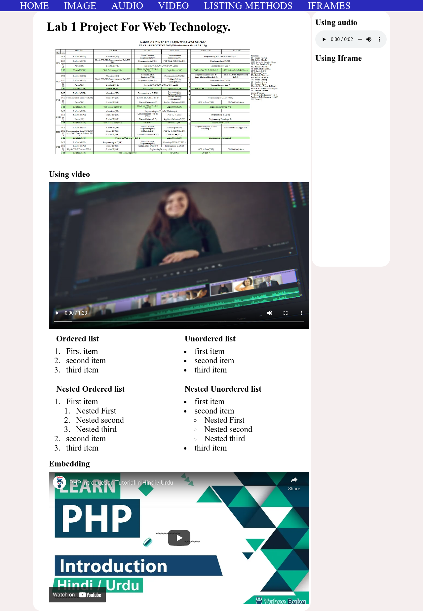

Date : Sunday ,April 24 - 2022
## Lab 1: HTML Elements.
* Make a webpage with the following html elements:
	* Nested order and unorder list
	* semantics tags for the layout
	* text formatting tags
	* image, video and audio
	* iframe

    - Final index file ([View](index.html)) / live website [View](https://narayandhakal09.github.io/wt-lab-assignment/Labs/Lab%201/index.html)
    
    
