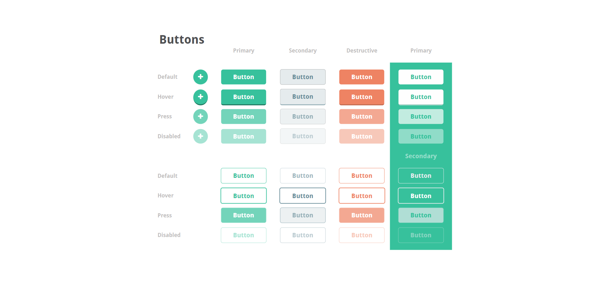
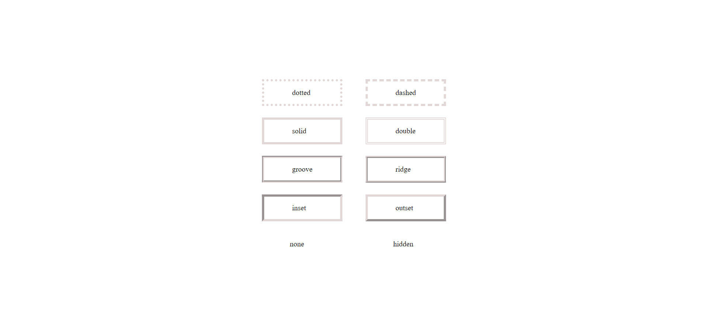

# Lab 2: Buttons, Border, Color and Pseudo class.

Date : Tuesday ,MAY 3 - 2022

- [Lab 2: Buttons, Border, Color and Pseudo class.](#lab-2-buttons-border-color-and-pseudo-class)
  - [Q1 Create buttons as per given figure.](#q1-create-buttons-as-per-given-figure)
  - [Q2 Create borders as per given figure](#q2-create-borders-as-per-given-figure)
  - [Theory](#theory)
    - [CSS Selectors](#css-selectors)
    - [CSS Box Model](#css-box-model)
    - [Explanation of the different parts](#explanation-of-the-different-parts)
    - [CSS Margins](#css-margins)
    - [CSS Padding](#css-padding)
    - [CSS Pseudo-classes](#css-pseudo-classes)
      - [Syntax](#syntax)


##  Q1 Create buttons as per given figure.
- Question ([View](https://github.com/nishalgurung4/wt-2020/tree/main/Labs/Lab2))
  - Final Buttons Ui ([View](Buttons.html)) / live website [View](https://narayandhakal09.github.io/wt-lab-assignment/Labs/Lab%202/Buttons.html)

  

---

## Q2 Create borders as per given figure

- Question ([View](https://github.com/nishalgurung4/wt-2020/tree/main/Labs/Lab2))
  
- Final borders  ([View](Borders.html)) / live website [View](https://narayandhakal09.github.io/wt-lab-assignment/Labs/Lab%202/Borders.html)

    

---

## Theory

---

### CSS Selectors

- A CSS selector selects the HTML element(s) you want to style.
- Simple selectors (select elements based on name, id, class)
- Combinator selectors (select elements based on a specific relationship between them)
- Pseudo-class selectors (select elements based on a certain state)
- Pseudo-elements selectors (select and style a part of an element)
- Attribute selectors (select elements based on an attribute or attribute value)

### CSS Box Model

- In CSS, the term "box model" is used when talking about design and layout

### Explanation of the different parts

- Content - The content of the box, where text and images appear
- Padding - Clears an area around the content. The padding is transparent
- Border - A border that goes around the padding and content
- Margin - Clears an area outside the border. The margin is transparent
- The box model allows us to add a border around elements, and to define space between elements.

### CSS Margins

The CSS margin properties are used to create space around elements, outside of any defined borders.

With CSS, you have full control over the margins. There are properties for setting the margin for each side of an element (top, right, bottom, and left).

```css
btn {
  margin-top: 100px;
  margin-bottom: 100px;
  margin-right: 150px;
  margin-left: 80px;
}

```

### CSS Padding

Padding is used to create space around an element's content, inside of any defined borders.

```css
btn {
  padding-top: 50px;
  padding-right: 30px;
  padding-bottom: 50px;
  padding-left: 80px;
}

```
The padding shorthand property with four values:

```css
div {
  padding: 25px 50px 75px 100px;
}

```

### CSS Pseudo-classes

What are Pseudo-classes?
- A pseudo-class is used to define a special state of an element.

For example, it can be used to:

* Style an element when a user mouses over it
* Style visited and unvisited links differently
* Style an element when it gets focus

#### Syntax

```Css

selector:pseudo-class {
  property: value;
}

```
some of the used pseudo classes on the file are 

```css
/* default link */
a:link {
  color: #FF0000;
}

/* after visited link */
a:visited {
  color: #00FF00;
}

/* mouse on hover link */
a:hover {
  color: #FF00FF;
}

/* Pressed link */
a:active {
  color: #0000FF;
}
```

