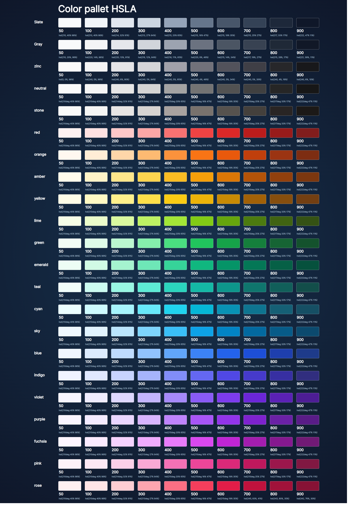

# Tailwind css Color components pallet copy version 
- [Tailwind css Color components pallet copy version](#tailwind-css-color-components-pallet-copy-version)
  - [Preview](#preview)
  - [Description](#description)
    - [Color](#color)
      - [syntax](#syntax)
  - [HSL Value](#hsl-value)


## Preview

- Tailwind css colors Ui ([View](index.html)) / live website [View](https://narayandhakal09.github.io/wt-lab-assignment/Labs/lab%203/Index.html)
  

## Description


### Color

        The color CSS property sets the foreground color value of an element's text and text decorations, and sets the <currentcolor> value. currentcolor may be used as an indirect value on other properties and is the default for other color properties, such as border-color.

With CSS, colors can be specified in different ways:

*  By color names
* As RGB values
* As hexadecimal values
* As HSL values (CSS3)
* As HWB values (CSS4)
* With the currentcolor keyword

#### syntax


```css
/* Keyword values */
color: currentcolor;

/* <named-color> values */
color: red;
color: orange;
color: tan;
color: rebeccapurple;

/* <hex-color> values */
color: #090;
color: #009900;
color: #090a;
color: #009900aa;

/* <rgb()> values */
color: rgb(34, 12, 64, 0.6);
color: rgba(34, 12, 64, 0.6);
color: rgb(34 12 64 / 0.6);
color: rgba(34 12 64 / 0.3);
color: rgb(34.0 12 64 / 60%);
color: rgba(34.6 12 64 / 30%);

/* <hsl()> values */
color: hsl(30, 100%, 50%, 0.6);
color: hsla(30, 100%, 50%, 0.6);
color: hsl(30 100% 50% / 0.6);
color: hsla(30 100% 50% / 0.6);
color: hsl(30.0 100% 50% / 60%);
color: hsla(30.2 100% 50% / 60%);

/* <hwb()> values */
color: hwb(90 10% 10%);
color: hwb(90 10% 10% / 0.5);
color: hwb(90deg 10% 10%);
color: hwb(1.5708rad 60% 0%);
color: hwb(.25turn 0% 40% / 50%);

/* Global values */
color: inherit;
color: initial;
color: revert;
color: revert-layer;
color: unset;

```

## HSL Value

        HSL stands for hue, saturation, and lightness.
In CSS, a color can be specified using hue, saturation, and lightness (HSL) in the form:

        hsl(hue, saturation, lightness)

Hue is a degree on the color wheel from 0 to 360. 0 is red, 120 is green, and 240 is blue.
Saturation is a percentage value, 0% means a shade of gray, and 100% is the full color.
Lightness is also a percentage, 0% is black, 50% is neither light or dark, 100% is white
Experiment by mixing the HSL values below:
